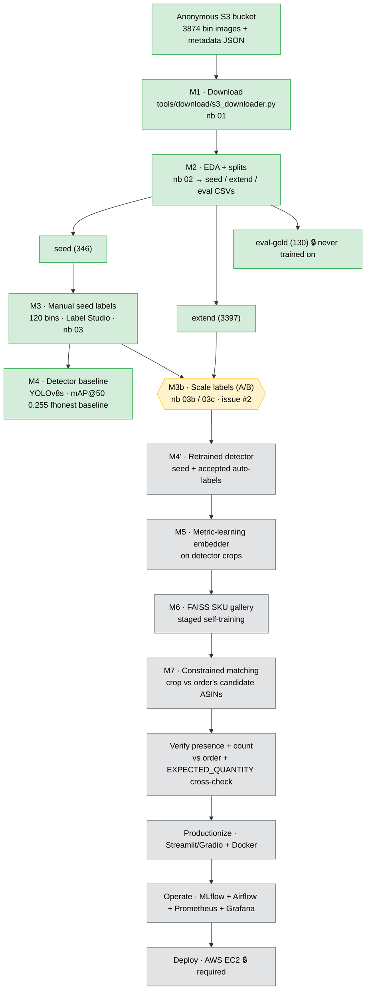
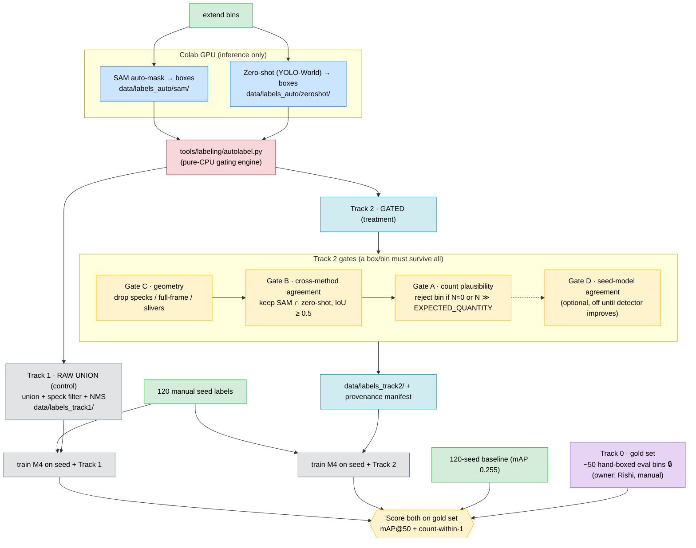
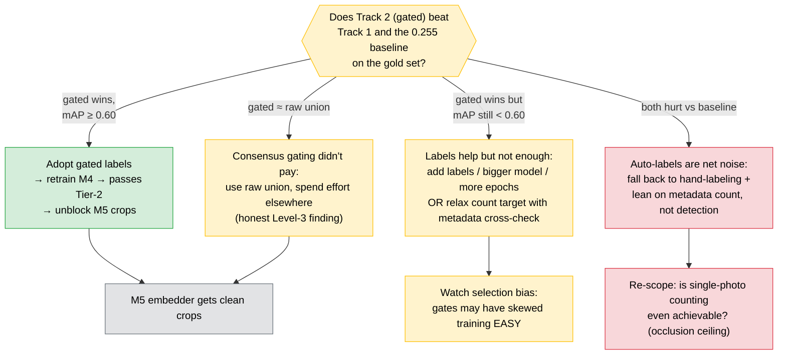
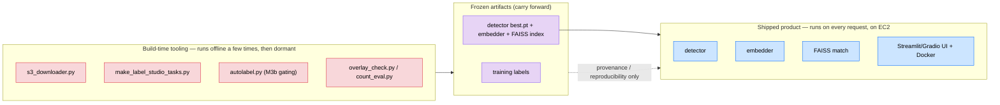

# BinSense — Data Flow & Decision Map

*Living document. Snapshot: 2026-07-09 (M3b in progress). Renders on GitHub via Mermaid.*

This maps **what data flows where**, **which decisions are locked**, and **how the
current M3b labeling A/B branches into the rest of the project**. Read it top-to-bottom:
(1) the end-to-end pipeline, (2) the M3b labeling detail, (3) how M3b's *result* changes
future work, (4) what is build-time tooling vs what actually ships.

Legend: ✅ done · 🟡 in progress · ⬜ future · 🔒 locked decision

---

## 1. End-to-end pipeline (data → model → product → deploy)

**Where we are:** the detector exists but is data-starved (both gates missed). Everything
downstream (M5→deploy) waits on a detector good enough to produce clean crops. M3b is the
unblock.

---

## 2. M3b in detail — the labeling A/B (current work)

The question M3b answers: **can we scale labels past the 120-bin seed *without* poisoning
the detector with noisy auto-labels — and can we prove it?**

**Key design choices baked in here:**
- GPU does *only* inference; **all quality logic is CPU + testable** (`autolabel.py`).
- Track 1 exists purely as the **control** — it exposes the noise floor so Track 2 has
  something to beat. It is not a production label set.
- **Gate A operates per-bin** (accept/reject the whole bin); Gates B/C operate per-box.
- Track 0 gold set is the **only trustworthy ruler** — without it, mAP is measured on 18
  noisy val images and can't be trusted.

---

## 3. How the M3b *result* branches future work (impact)

The A/B outcome is a fork that changes what M4→M5 look like:

**Why this matters for scheduling (8 days to deadline):** whichever branch we land on,
the required deliverable is the **EC2 deployment**. So M3b is time-boxed — a "good enough"
detector plus an honest report beats a perfect detector with no deployed app.

---

## 4. Build-time tooling vs the shipped product

Not everything in the repo runs in production. This separation drives the final structure:

`autolabel.py` lives in the **left box**: it produces labels, then goes quiet. It never
ships to EC2. It stays in the repo as the auditable record of *how* labels were made (a
graded deliverable), but the running app only needs the trained weights.

---

## 5. Locked-decision log (the "why", for the video)

| # | Decision | Rationale |
|---|---|---|
| D1 | YOLO single-class detection (count instances) → embedder → FAISS → **constrained** matching | Compare each crop only to the *order's* candidate ASINs, not all 5285 — makes the problem tractable |
| D2 | Staged self-training (Option A) for identity | Seed from single-ASIN bins, pseudo-label multi-ASIN bins; grows catalog coverage without full manual labels |
| D3 | Demonstrate all 3 labeling methods (manual → SAM → zero-shot) | Brief requires it; also lets us A/B raw vs gated auto-labels |
| D4 | Ship M4 as an **honest baseline** (mAP 0.255) before M3b | The whole M3b A/B is framed as "beat this baseline"; needs it in master |
| D5 | Track 0 gold set is a prerequisite | Only trustworthy mAP ruler; 18-image val split is too noisy to tune against |
| D6 | Gating logic on CPU (`autolabel.py`), GPU does inference only | Testable without a GPU; the intellectual core is auditable |
| D7 | Notebooks are the deliverable; `tools/` is the engine | Mentor brief wants narrative notebooks; engine keeps them thin |
| D8 | EC2 deployment is non-negotiable → M3b is time-boxed | Required deliverable; don't let labeling perfection eat the deploy |
| D9 | **Auto-labeling abandoned** — raw union noisy, SAM∩zero-shot starved, SAM∩M4 correlated-errors | Measured on ~200 bins; fully-automatic labeling can't box items on cluttered/occluded ABID bins. See `M3b_FINDINGS.md` |
| D10 | **Pivot to Siamese-first (2026-07-09)** — Siamese similarity model is the graded core; detection demoted to optional | Evaluator template (`Copy of Week 4 & 5.ipynb`) = Siamese + ROC/threshold/confusion (VGG16 vs ResNet50), **no detection**. Core needs no detection labels |
| D11 | Keep M4 baseline + M3b engine as an **optional counting/innovation add-on**, not critical path | Objectives reward innovation; the explored-and-set-aside branch is legitimate video content |

> **Status note (2026-07-09):** the pivot demotes the detection column of the §1 pipeline.
> New critical path: **M5 Siamese similarity** (whole-bin pairs) → verify (ROC/threshold/
> confusion) → productionize → EC2. YOLO/M4/M3b remain in-repo as an optional enhancement.

---

*Update this file as milestones land — it's the map the final video's three levels
(business / decisions / library deep-dive) narrate against.*
